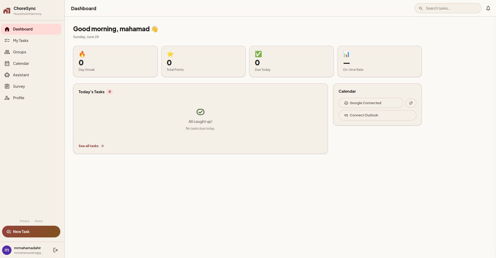
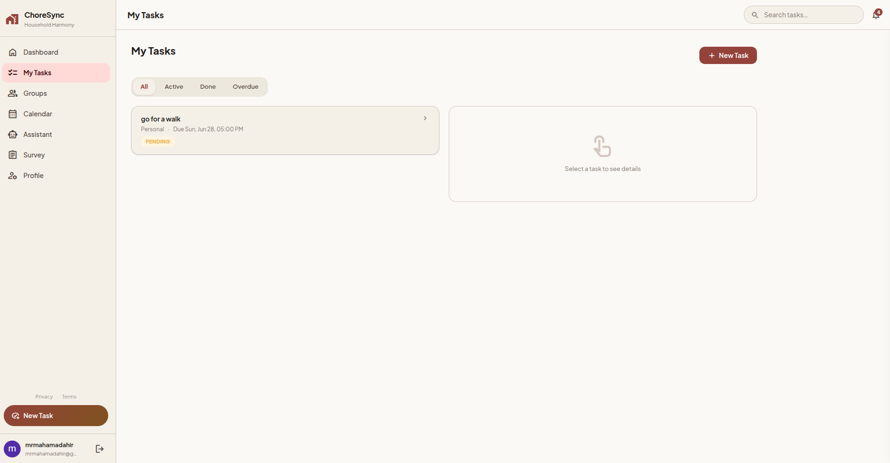
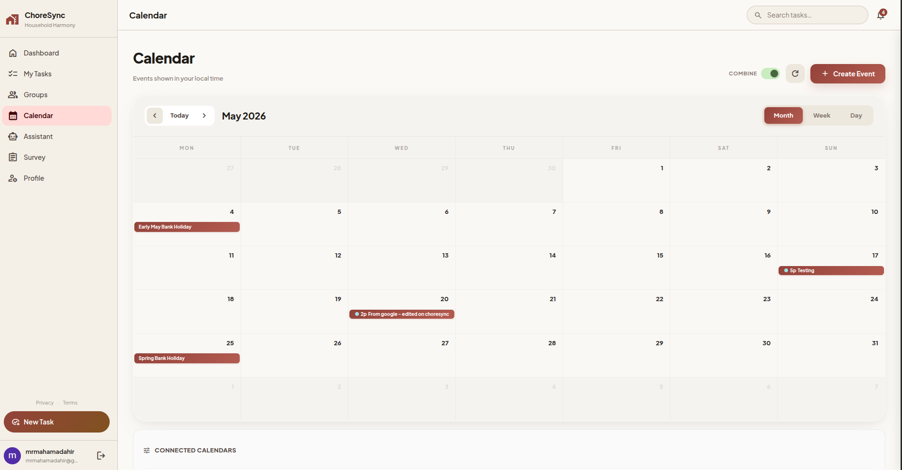
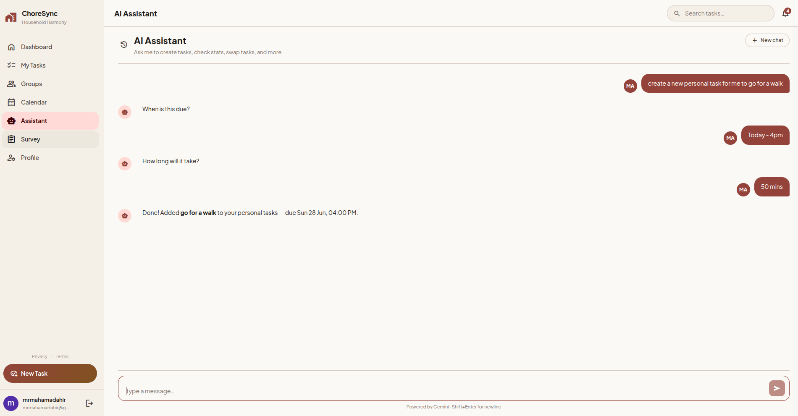

# ChoreSync

A household chore app that decides whose turn it is, so flatmates stop arguing about it.

**[Download for Android](https://github.com/Mahamadahir/ChoreSync/releases/latest)** · built by [Mahamad Dahir](mailto:mrmahamadahir@gmail.com)

> This repository is a showcase. It explains how ChoreSync is built and what went
> into it. The source code is private.

---

## The problem I built it for

My flat spent the best part of a year negotiating the bin rota in the group chat. A fixed rota never survived contact with reality: someone was away, someone had done more than their share, someone just hated taking the recycling out. So I built ChoreSync to make the call for us.

Instead of a static schedule, ChoreSync works out who *should* get a task from who has done the least lately, what people actually mind doing, and whether they are even home that day. It won't hand you the bins on an evening it knows you're out. That fairness engine is the core of the app, and the part I am most proud of.

I built it over my final year as a full-stack project: a Django backend, a Vue web app, and a React Native Android app, deployed on Kubernetes.

---

## Screenshots

| Dashboard | My tasks |
|---|---|
|  |  |

| Calendar sync (Google + Outlook) | AI assistant |
|---|---|
|  |  |

---

## What it does

- **Fair assignment.** A scoring pipeline picks the fairest available person for each chore and shows you exactly why you were chosen.
- **Recurring chores.** Set up a task once with a recurrence rule; the app generates each occurrence and assigns it.
- **Calendar-aware scheduling.** Two-way sync with Google Calendar and Outlook, so the app won't assign you a task when you're busy.
- **Swaps and emergencies.** Trade a chore with a housemate, or hand off one you can't do, and the app reassigns it fairly.
- **Proposals and voting.** Suggest a change and let the household vote on it.
- **Points, streaks and badges.** Light gamification to keep people engaged, with a per-household leaderboard.
- **A marketplace.** List a chore for someone else to pick up for bonus points.
- **An AI assistant.** Tell it 'I did the dishes' in plain English and it sorts the rest.
- **Real-time chat and notifications.** Household chat with read receipts, plus push notifications to your phone.

---

## How the fair assignment works

This is the interesting bit. Every candidate gets a score, and the **lowest score wins** (lower means fairer and a better fit). The full breakdown is saved and shown to the user, so the decision is never a black box.

1. **Fairness (0–1).** A normalised score from the work each person has already done: number of tasks, estimated time spent, points earned, and a 'mental load' measure that counts invisible coordination work like creating templates, proposing changes, and voting.
2. **Stated preference.** If you've marked a chore as one you prefer or avoid, that multiplies your score down or up.
3. **Learned preference.** Where you haven't said anything, the app reads your history. A high completion rate on a chore nudges it towards you; repeatedly swapping it away nudges it off you.
4. **Calendar availability.** Time you're busy over the task window adds a penalty, but only an additive one. A packed calendar shifts the decision; it never lets you dodge a chore that fairness says is yours.

Ties break by whoever was assigned least recently, then by who joined the household first.

I wrote this up in full, including the data model and the real-time and calendar internals, in [docs/ARCHITECTURE.md](docs/ARCHITECTURE.md).

---

## Tech stack

| Layer | Built with |
|---|---|
| Backend | Django 5, Django REST Framework, Daphne (ASGI) |
| Async work | Celery + beat, Redis broker |
| Real-time | Django Channels (WebSockets), Server-Sent Events, Expo push |
| Database | PostgreSQL |
| AI | Google Gemini over REST |
| Web app | Vue 3, Quasar, Pinia, Vite |
| Mobile app | React Native (Expo SDK 52) |
| Auth | Session + CSRF (web), JWT (mobile), Google and Microsoft SSO |
| Deployment | Kubernetes (OpenShift), GitHub Actions CI/CD, Cloudflare |

---

## Engineering I'm proud of

A few things that took real work beyond the features:

- **A provider-agnostic calendar layer.** Google and Outlook write into one shared event store using a Strategy pattern, so the assignment engine queries availability with no provider-specific branches. Adding a new calendar provider means writing one class.
- **Incremental sync that survives rate limits.** The initial Google sync pulls two years of events in monthly chunks, checkpointing after each, so a 429 resumes instead of restarting. Live webhooks are paused during the backfill so they don't race it.
- **A real-time layer with three delivery paths.** One call fans a notification out over WebSocket, SSE, and push, persisting it first so a dropped connection replays on reconnect rather than losing messages.
- **Production operations on Kubernetes.** I moved Postgres onto persistent storage after finding it was writing to ephemeral container storage, added automated daily database backups, wrote a deep health check that reports the database and broker rather than just answering 200, and added an external heartbeat so a silently dead background worker pages me.
- **A two-phase account deletion** with a 14-day grace period and a nightly purge, with the full cascade behaviour documented.

---

## Status

Live on Android and in active development. I'm looking for real households to try it and tell me what's confusing or broken.

---

## Feedback

I'd genuinely rather have feedback than downloads right now. If you hit a bug or have an idea, [open an issue](../../issues) or email me at [mrmahamadahir@gmail.com](mailto:mrmahamadahir@gmail.com).

---

## Licence

ChoreSync is proprietary. © 2026 Mahamad Dahir. All rights reserved. This repository documents the project; it does not grant any rights to the software or its source. See [LICENSE](LICENSE).
